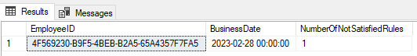

LabourDB - create test DB before perform next steps

**UPDATE:** 
---------------
Here the updated version of script which will show the number of violated break rules.
Previous version was not taken into account **TakeBreakWithin**..
**Note:** Here we assume that after N hours of work (despite on count of taken breaks) 
employee must take the break during next T hours.


The full code you can see in **[InitScriptWithSolution.sql](InitScriptWithSolution.sql)**

```sql
-- query which will return not satisfied rules breakRules
WITH TimeBreaksInfo AS (
    SELECT 
        TC.EmployeeId,
        TC.BusinessDate,
		TC.StartDate as WorkingSessionStart,
        TC.endDate AS WorkingSessionEnd,
        BreakDurationInMinutes = DateDiff(MINUTE, TC.EndDate, LEAD(TC.startDate) OVER (PARTITION BY TC.EmployeeId, TC.BusinessDate ORDER BY TC.startDate ASC)),
	PrevSessionsDurationInHours = SUM(DateDiff(MINUTE, TC.StartDate, TC.endDate)/60.0) OVER (PARTITION BY TC.EmployeeId, TC.BusinessDate ORDER BY  TC.StartDate ROWS BETWEEN UNBOUNDED PRECEDING AND 1 PRECEDING),
	LastWorkingSessionDurationInHours = DateDiff(MINUTE, TC.StartDate, TC.endDate)/60.0
    FROM @TimeCards TC
) 
SELECT 
	EmployeeID,
	BusinessDate,
	NumberOfNotSatisfiedRules = sum(violatedBreakRules.NumberOfNotSatisfiedRules)
	FROM TimeBreaksInfo tbi CROSS APPLY
	( 
		select 
			NumberOfNotSatisfiedRules = count(*)
		from @BreakRules br 
		where 
			br.BreakRequiredAfter between tbi.PrevSessionsDurationInHours and (isnull(tbi.PrevSessionsDurationInHours,0) + LastWorkingSessionDurationInHours)
			and 
			(
			   br.BreakRequiredAfter + TakeBreakWithin < (isnull(tbi.PrevSessionsDurationInHours,0) + LastWorkingSessionDurationInHours)
				or
				IsNull(BreakDurationInMinutes, MinBreakMinutes) < MinBreakMinutes
			)
	) violatedBreakRules
group by EmployeeID, BusinessDate
having sum(violatedBreakRules.NumberOfNotSatisfiedRules) > 0
order by EmployeeID, BusinessDate
```

The result of executing the query is next:



**LabourDB deploy:**
--------------------
For the ability to test code on much larged data for the find perfomance issues
here the project which might be deployed with auto-populate the TimeCards table.

```sql
CREATE DATABASE LabourDB;
```

The project LabourDB can be deployed to own server. Use VS2019. 

```sql
Timecards TABLE(	
		ID int Identity(1,1),	
		BusinessDate smalldatetime ,
		StartDate datetime ,
		EndDate datetime,
		EmployeeID uniqueidentifier  	
)
BreakRules TABLE(	
	ID int Identity(1,1),	
	MinBreakMinutes int  ,
	BreakRequiredAfter  decimal(10,2) ,
	TakeBreakWithin  decimal(10,2) 
)
```

The **[Views\vw_ViolatedBreakRules.sql](Views\vw_ViolatedBreakRules.sql)** can be used for review the **NumberOfNotSatisfiedRules**
```sql
    select * from [dbo].[vw_ViolatedBreakRules]
```